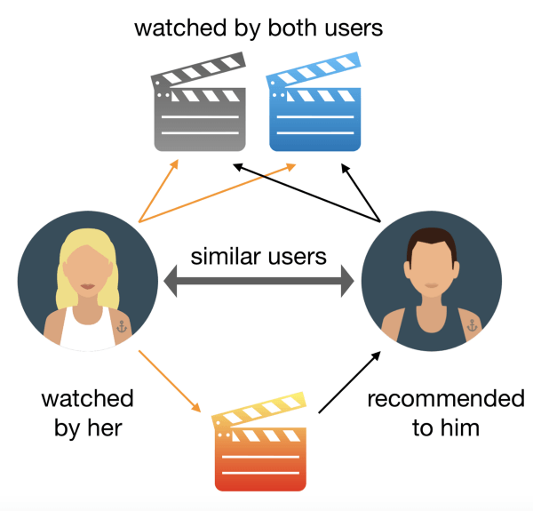

# Recommendation Engine

In this project, I built a Recommendation System able to predict whether a user is going to like the next movie. 

Go to project: https://bit.ly/2YnoMyN

## Summary

• Problem Statement

• Data Collection

• Data Cleaning

• Data Analysis

• Recommendation Engine

• Model Evaluation

## Tools

• Python 3.6.9

• Jupyer Notebook

• Pandas

• Seaborn

• Matplotlib

• NumPy

• Surprise

• Pickle
